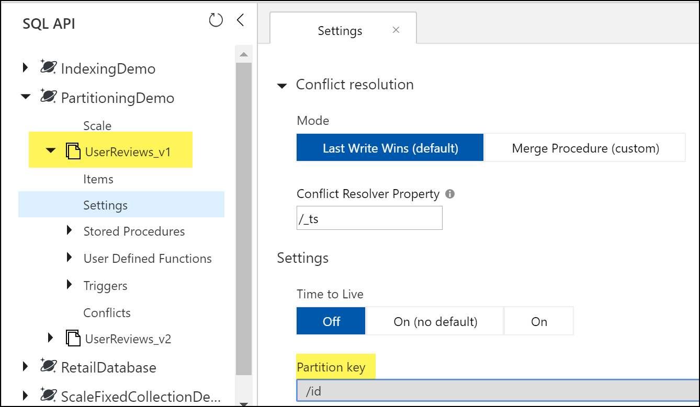

# Cosmos Optimization Tips & Tricks demo
This repository contains a demo of several performance optimization tips with Azure Cosmos DB. It uses Version 3 of the .NET SDK, which targets .NET Standard 2.0. You can learn more about the .NET V3 SDK [here.](https://azure.microsoft.com/blog/new-for-developers-azure-cosmos-db-net-sdk-v3-now-available/)


## Setup instructions

1. Follow these [instructions](https://docs.microsoft.com/azure/cosmos-db/how-to-manage-database-account) to create a new Azure Cosmos DB account for SQL API.
    - Do not enable multi-region writes or geo-redundancy. 
    - Choose a region that is the same as your VM region.
    - If you wish to demo [Scenario 1](#scenario-1-query-is-taking-longer-than-expected), after the account is created, add a 2nd region that is far away from your Azure VM.

1. Clone the repo into a VM running in Azure. 
    - For best performance and low latency, the VM should be in the same region as one of your Azure Cosmos DB account regions. 
    - You can use a Windows [Data Science VM](https://azure.microsoft.com/services/virtual-machines/data-science-virtual-machines/) as it has all dependencies installed. 
Otherwise, you will need a VM with [.NET Core](https://dotnet.microsoft.com/download) (required) and [Visual Studio 2017 or 2019](https://visualstudio.microsoft.com/downloads/) (optional, if you'd like to inspect or edit code).

1. Open the ```App.config``` file and fill in the ```EndpointUri``` and ```PrimaryKey``` variables with your Cosmos account information. If you want to log the data to AppInsights, fill in the ```AppInsightsKey``` variable.

1. To start the application:
    - From Visual Studio, select **Ctrl + F5** to start the application. 
    - From a command line, navigate to the root of the project (the library with ```CosmosOptimization.csproj```) and type ```dotnet run```.

Now, you can select different options for the scenario you'd like to demo. If this is the first time running the demo, run [Scenario 0](#scenario-0-setup-the-required-databases-containers-and-import-the-data) to automatically create the required Cosmos resources and ingest the data.

## Demo scenarios
[**Scenario 0**: Setup the required databases, containers and import the data.](#scenario-0-setup-the-required-databases-containers-and-import-the-data)

[**Scenario 1**: Query is taking longer than expected](#scenario-1-query-is-taking-longer-than-expected)

[**Scenario 2**: Query is consuming high RU - cross partition query](#scenario-2-query-is-consuming-high-ru---cross-partition-query)

[**Scenario 3**: Using query instead of point reads](#scenario-3-using-query-instead-of-point-reads)

[**Scenario 4**: Tuning MaxItemCount per page](#scenario-4-tuning-maxitemcount-per-page)

[**Scenario 5**: Tuning Cross-partition queries](#scenario-5-tuning-cross-partition-queries)

[**Scenario 6**: Use the Stream API for Web API scenarios](#scenario-6-use-the-stream-api-for-web-api-scenarios)

[**Scenario 7**: Tune the indexing policy - for write-heavy scenarios](#scenario-7-tune-the-indexing-policy---for-write-heavy-scenarios)

[**Scenario 8**: Scaling fixed containers with partition keys](#scenario-8-scaling-fixed-containers-with-partition-keys)

### **Scenario 0**: Setup the required databases, containers and import the data.

Creates the following resources, with minimum 400 RU/s per database, unless otherwise noted.

|Database  |Container(s)  |Notes  |
|---------|---------|---------|
|PartitioningDemo     |   UserReviews_v1 </br> UserReviews_v2    |  To run scenario 2, which demonstrates the RU impact of cross partition queries, the database ```PartitioningDemo``` is ***provisioned with 300,000 RU/s*** (est. $24/hr per region with single region write setup) to simulate a workload with many partitions. The setup code immediately scales it back down to the minimum after the data is imported. </br></br>If you do not wish to demo scenario 1, find the database creation code for ```PartitioningDemo``` in  ```Setup_CosmosResources()``` and replace the throughput with 400 RU/s. Note the import will also go more slowly.        |
|IndexingDemo     |     DefaultIndexPolicy </br> TunedIndexPolicy     |       |
|ScaleFixedContainerDemo     |  FixedContainer       |    Creates fixed container with 400 RU/s.   |

There are 2 "types" or entities of data, differented by the ```documentType``` property. As a best data modelling practice, we put these types into the same container, as they are logically related for our queries. Each document type as a ```username``` that relates the user to their product reviews.

**User**
```json
    {
        "id": "Curt28",
        "username": "Curt28",
        "firstName": "Emmett",
        "lastName": "Cruickshank",
        "country": "Falkland Islands (Malvinas)",
        "phoneNumber": "(507) 385-2248 x657",
        "loyaltyTier": "silver",
        "emailAddress": "Emmett_Cruickshank@yahoo.com",
        "memberSince": "2017-08-03T17:02:13.6185839+00:00",
        "memberSinceYear": "2017",
        "documentType": "user"
    }
```

**ProductReview**

```json
    {
        "id": "693335bc-e7f0-4231-9434-941bbe6c0561",
        "username": "Curt28",
        "verifiedPurchase": true,
        "product": "Button-Up Shirt",
        "review": "I saw one of these in Tanzania and I bought one.",
        "rating": 0.2,
        "reviewDate": "2018-09-16T21:40:39.4427536+00:00",
        "documentType": "review"
    }
```

### **Scenario 1**: Query is taking longer than expected 
```Issue1_Latency()``` demonstrates the importance of setting ```ApplicationRegion``` to the correct region. 

```csharp
var cosmosClientOptions = new CosmosClientOptions()
{
    //To demo the "Why is latency high" scenario, run Scenario 1 with the region set to a Cosmos region different from the region your VM is in. For the other scenarios, set the region to your VM region. 

    ApplicationRegion = "West US 2",
    //ApplicationRegion = "East US 2",
};

// Create a new instance of the Cosmos Client
this.cosmosClient = new CosmosClient(EndpointUri, PrimaryKey, cosmosClientOptions);
```

When run against East US 2 (different region than VM):
```bash
Running query: SELECT * FROM c WHERE c.username = 'Curt28' against container UserReviews_v1

        Query returned 881 results
        Total time: 00:00:14.87
        Total Request Units consumed: 123.636
```

When run against West US 2 (same region as VM):
```bash
 Running query: SELECT * FROM c WHERE c.username = 'Curt28' against container UserReviews_v1

    Query returned 881 results
    Total time: 00:00:00.33
    Total Request Units consumed: 123.636
```

**Best practice(s)**: 
- Set ```ApplicationRegion``` during ```CosmosClient``` setup. If it is not set, by default Azure Cosmos DB sends all requests to the first region created. 
- Do all performance/benchmarking tests in an environment in Azure, not a local machine. 

### **Scenario 2**: Query is consuming high RU - cross partition query
```Issue2_HighRU()``` shows the importance of choosing a good partition key for read or query heavy scenarios. We saw in Scenario 1 that the RU charge was 123.6 RUs, which was higher than expected. 

```bash
Running query: SELECT * FROM c WHERE c.username = 'Curt28' against container UserReviews_v1

        Query returned 881 results
        Total time: 00:00:02.14
        Total Request Units consumed: 123.636
```

The query ```SELECT * FROM c WHERE c.username = 'Curt28'``` filters on ```username```. To make this query efficient, our container should have ```username``` as the partition key. However, it is partitioned by ```id```, which means we're running a cross-partition query. 



In contrast, when we run the query against ```UserReviews_v2``` which is partitioned by ```username```, the RU charge is nearly 1/2 as much.

```bash
Running query: SELECT * FROM c WHERE c.username = 'Curt28' against container UserReviews_v2

        Query returned 881 results
        Total time: 00:00:00.22
        Total Request Units consumed: 62.53
```

**Best practice(s)**: 
- For read or query heavy scenarios, [choose a partition key](https://docs.microsoft.com/azure/cosmos-db/partitioning-overview#choose-partitionkey) that can be used as the filter in the majority of your queries, or as lookup keys (see [Scenario 3](#scenario-3-using-query-instead-of-point-reads)).
- Measure the RU charge of your queries on a representative dataset. For smaller workloads (e.g. < 50GB, 50k RU/s), the additional cost incurred by checking multiple partitions will be minimal. 
- Cross-partition queries may be ok if they are run infrequently (e.g. few times/hour).

### **Scenario 3**: Using query instead of point reads

```Issue3_QueryVsPointRead()``` shows the increased performance of using [point reads](https://docs.microsoft.com/dotnet/api/microsoft.azure.cosmos.container.readitemasync?view=azure-dotnet) over queries, when applicable. 

Suppose we want to lookup a user's profile. Our container has both a ```User``` and a ```ProductReview``` type. The query ``` SELECT * FROM c WHERE c.username = 'Curt28' AND c.documentType = 'user'``` will return 1 document, the ```User``` document. 

```bash
Running query: SELECT * FROM c WHERE c.username = 'Curt28' AND c.documentType = 'user' against container UserReviews_v2

        Query returned 1 results
        Total time: 00:00:01.49
        Total Request Units consumed: 3.06
```
However, we can achieve the same result by using ```ReadItemAsync()``` to lookup the user profile by id and partition key. This point read costs only 1 RU, as opposed to 3 RU for the query. This means for the same provisioned RU/s, we can get 3x the number of reads/second!

```bash
Running point read: await container.ReadItemAsync<User>(id, partitionKeyValue)
        Point read returned 1 results
        Total time: 00:00:00.05
        Total Request Units consumed: 1
```
**Best practice(s)**: 
- Consider using point reads when applicable. When returning 1 document, they will typically be cheaper than queries that return the same results. Common scenarios for point read lookups include product catalogs, device registries, and user profiles. 
- Did you know? Azure Cosmos DB's latency SLA of <10ms for read and write at P99 is benchmarked on point reads of a 1KB document.

### **Scenario 4**: Tuning ```MaxItemCount``` per page
```Issue4_TuneMaxItemCount()``` shows how to tune the [MaxItemCount](https://docs.microsoft.com/dotnet/api/microsoft.azure.documents.client.feedoptions.maxitemcount?view=azure-dotnet), i.e. max items per page, setting for lower latency. 

Azure Cosmos DB returns query results in pages. By default, results are returned in chunks of 100 items (.NET V2 SDK) or 1MB, whichever limit is hit first. Setting ```MaxItemCount``` to ```-1``` allows the SDK to automatically find the most optimal value depending on the document size. In .NET SDK V3, MaxItemCount is set to -1 as the default. 

```bash
Running query: SELECT * FROM c WHERE c.username = 'Curt28' against container UserReviews_v2

Using MaxConcurrency: -1
Using MaxItemCountPerPage: 50
Result count: 50
Result count: 100
...
Result count: 850
Result count: 881
        Query returned 881 results
        Total time: 00:00:01.54
        Total Request Units consumed: 86.98
```

Setting ```MaxItemCount = -1``` gets us all 881 documents in 1 trip, resulting in lower latency and RU charge.

```bash
Running query: SELECT * FROM c WHERE c.username = 'Curt28' against container UserReviews_v2

Using MaxConcurrency: -1
Using MaxItemCountPerPage: -1
Result count: 881
        Query returned 881 results
        Total time: 00:00:00.07
        Total Request Units consumed: 40.81
```
**Best practice(s)**: 
- Set ```MaxItemCount``` depending on your application's needs. 
    - If you need to return all results of a query quickly, set to -1. 
    - If you only need to return a few results, set to that value to reduce RU consumed. 
- By default, in .NET SDK V2, ```MaxItemCount = 100```. In .NET SDK V3, ```MaxItemCount = -1```. Always tune this value if you're using .NET SDK V2. 

### **Scenario 5**: Tuning Cross-partition queries
```Issue5_TuneCrossPartitionQuery()``` shows how we can optimize cross-partition queries from the client side. The setting [MaxConcurrency](https://docs.microsoft.com/dotnet/api/microsoft.azure.cosmos.queryrequestoptions.maxconcurrency?view=azure-dotnet) controls how many partitions the SDK can query in parallel. By setting to -1, the SDK queries all partitions in parallel, resulting in lower query latency, with the tradeoff of more client-side resources being used. In .NET V2 SDK, this setting is called ```MaxDegreeOfParallelism```.

When we set ```MaxConcurrency``` = -1, we get lower latency than when it = 0 (no parallelism, i.e. querying all partitions sequentially).
```bash
Running query: SELECT * FROM c WHERE c.rating >= 4.7 against container UserReviews_v2

Using MaxConcurrency: -1
Using MaxItemCountPerPage: -1
Result count: 2450
Result count: 4480
...
Result count: 68060
        Query returned 68060 results
        Total time: 00:00:07.56
        Total Request Units consumed: 3033.13
```

```bash
Running query: SELECT * FROM c WHERE c.rating >= 4.7 against container UserReviews_v2

Using MaxConcurrency: 0
Using MaxItemCountPerPage: -1
Result count: 2450
Result count: 4480
...
Result count: 68060
        Query returned 68060 results
        Total time: 00:00:09.22
        Total Request Units consumed: 3033.13
```

**Best practice(s)**: 
- ```MaxConcurrency``` is useful for optimizing a cross-partition query. This includes queries that target specific partitions, e.g. ```SELECT * FROM c WHERE c.username IN ('alice', 'bob')```.
- In .NET SDK V3, ```MaxConcurrency = -1``` is the default. For most use cases, setting to -1 is recommended. Otherwise, set to a value that satisfies the trade-off between faster query results vs. more resources consumed on the client-side. 

### **Scenario 6**: Use the Stream API for Web API scenarios
```Issue6_UsingStreamAPI()``` shows the new stream API available only in .NET SDK V3. Prior versions of the SDKs always serialized and deserialized the data to and from the network, leading to performance overhead. With the stream API for query [GetItemQueryStreamIterator](https://docs.microsoft.com/dotnet/api/microsoft.azure.cosmos.container.getitemquerystreamiterator?view=azure-dotnet), you can get the stream and pass it directly to the response. Stream APIs are also available for CRUD operations on databases, containers, and items. 

Without streams, for 1 page of results:
```bash
Running query without stream API: SELECT * FROM c WHERE c.rating >= 4.7 against container UserReviews_v2

        Query returned 100 results
        Total time: 00:00:01.32
        Total Request Units consumed: 14.24
```
With streams, for 1 page of results
```bash
Running query with stream API: SELECT * FROM c WHERE c.rating >= 4.7 against container UserReviews_v2

        Returned single page of query results as stream:
        {"_rid":"rTdtAPFEQMQ=","Documents":[{"id":"571fafb2-670d-4fe7-89f0-5a0e6f6e5d1b","username":"Winnifred.Labadie","verifiedPurchase":true,"product":"Cardigan Sweater","review":"talk about hatred.","rating":4.9,"reviewDate":"2017-08-16T10:43:37.4483529+00:00","documentType":"review","_rid":"rTdtAPFEQMSNhB4AAAAAAA==","_self":"dbs\/rTdtAA==\/colls\/rTdtAPFEQMQ=\/docs\/rTdtAPFEQMSNhB4AAAAAAA==\/","_etag":"\"ba00a62c-0000-0800-0000-5d81ca6f0000\"","_attachments":"attachments\/","_ts":1568787055},{"id":"2d0fa7c3-6b61-4da0-8f51-33382aa83119","username":"Elyse.Rohan","verifiedPurchase":true,"product":"High Heel Shoe","review":"This product works excessively well. It mortally improves my golf by a lot.","rating":4.7,"reviewDate":"2017-01-17T20:00:50.6...

        Total time: 00:00:00.03
        Total Request Units consumed: 14.24
```

### **Scenario 7**: Tune the indexing policy - for write-heavy scenarios
```Issue7_TuneIndexingPolicy()``` shows how we can reduce the RU charge for write operations by tuning the indexing policy. By default, Azure Cosmos DB automatically indexes all properties in all items, enabling efficient queries and flexible schemas. 

However, you may have a workload where not all properties are queried. For example, suppose we are writing a ```ProductReviewDetail``` item like this:

```json
{
    "id": "46b8fe25-eae2-462b-bb51-89d934687d1b",
    "partitionKey": "Doyle84",
    "username": "Doyle84",
    "verifiedPurchase": true,
    "product": "Cheese",
    "review": "this product is vertical.",
    "rating": 3.7,
    "reviewDate": "2018-12-14T07:14:52.0241559+00:00",
    "documentType": "review",
    "prop1": "Awesome",
    "prop2": "Ipsa dolorum nobis aspernatur qui in.",
    "prop3": "Esse maiores optio aspernatur provident commodi.",
    "prop4": "Nihil ipsam libero est unde sunt enim est a.",
    "prop5": "Unbranded",
    "prop6": "Unbranded",
    "prop7": "Sleek",
    "prop8": "Awesome",
    "prop9": "Fantastic",
    "prop10": "Small",
    "prop11": "Small",
    "prop12": "Licensed",
}
```
There are only a few properties we are interested in, e.g. the ```username```, ```product```, ```verifiedPurchase```, ```rating```. To optimize on RU charge for writes and reduce overall storage, we can choose to exclude the other properties from the index. 

**Create a container with default indexing policy**: 
```csharp
// Create containers for Indexing policy demo
var defaultIndexingPolicyContatinerName = "DefaultIndexingPolicy";

ContainerResponse defaultIndexingPolicyContainer = await indexingDemoDB.DefineContainer(name: defaultIndexingPolicyContatinerName, partitionKeyPath: "/partitionKey")
    .CreateIfNotExistsAsync();
```

**Create a container with explicitly included paths**: 
```csharp
var tunedIndexingPolicyContainerName = "TunedIndexingPolicy";

ContainerResponse tunedIndexingPolicyContainer = await indexingDemoDB.DefineContainer(name: tunedIndexingPolicyContainerName, partitionKeyPath: "/partitionKey")
    // Define indexing policy with included and excluded paths
    .WithIndexingPolicy()
    .WithIncludedPaths()
            .Path("/username/*")
            .Path("/productName/*")
            .Path("/verifiedPurchase/*")
            .Attach()
        .WithExcludedPaths()
            .Path("/*")
            .Attach()
        .Attach()
    .CreateIfNotExistsAsync();
```

We see that writing the same ```ProductReviewDetail``` item to the container with the tuned indexing policy reduced the RU charge by ~50%! This doubles the writes/sec we can achieve for the same provisioned RU/s.  
```bash
Write item to container DefaultIndexingPolicy with default indexing policy
        Consumed 25.9 RUs
```

```bash
Write item to container TunedIndexingPolicy with tuned indexing policy
        Consumed 12.19 RUs
```

**Best practice(s)**: 
- Considering [tuning the indexing policy](https://docs.microsoft.com/azure/cosmos-db/how-to-manage-indexing-policy) to only index the properties you need. This optimization should be applied if your goal is to reduce RU charge on writes (e.g. in write-heavy scenarios) or save on storage costs.  


### **Scenario 8**: Scaling fixed containers with partition keys
```Issue8_ScaleFixedContainer()``` shows how to scale non-partitioned or "fixed" containers beyond the 10GB and 10,000 RU/s throughput limit, available only in .NET V3 SDK.

All non-partitioned containers now have a system partition key ```_partitionKey``` that you can set to a value when writing new items. Once you begin using the _partitionKey value, Azure Cosmos DB will scale your container as its storage volume increases beyond 10GB. If you want to keep your container as is, you can use the PartitionKey.None value to read and write existing data without a partition key.

**Add item to container without partition key**
```csharp
// Add item to previously "fixed" container without partition key
var userTask = new UserTaskItem()
{
    Id = "bob",
    Status = "Learning Azure Cosmos DB!"
};
var bobTask = await container.CreateItemAsync<UserTaskItem>(userTask, PartitionKey.None); Console.ForegroundColor = ConsoleColor.Green;
```

**Add item to container with a partition key - we've just scaled our previously fixed container**
```csharp
// Now start taking advantage of partitioning! Create a new item with partition key value of user Id
var userTaskWithPartitionKey = new UserTaskItem()
{
    Id = "alice",
    PartitionKey = "alice",
    Status = "Partitioning all the data"
};

// Add item to container with partition key
var aliceTask = await container.CreateItemAsync<UserTaskItem>(userTaskWithPartitionKey, new PartitionKey(userTaskWithPartitionKey.PartitionKey));
```
**Example of User class**
```csharp
// Example of the User class
public class User
{
    public User()
    {
    }

    [JsonProperty(PropertyName = "id")]
    public string Id { get; set; }

    [JsonProperty(PropertyName = "_partitionKey", NullValueHandling = NullValueHandling.Ignore)] // Enbales optional PartitionKey value
    public string PartitionKey { get; set; }

    [JsonProperty(PropertyName = "status")]
    public string Status { get; set; }

}
```
**Best practice(s)**: 
- If you are using a non-partitioned (aka "fixed" container), and you want to scale beyond 10GB and 10,000 RU/s, use the latest SDK to do so, without having to move any of your existing data. Learn more in this [article](https://docs.microsoft.com/azure/cosmos-db/migrate-containers-partitioned-to-nonpartitioned). 

## About the data used
The data was generated by using Bogus library and is available in JSON format [here](https://cosmosnotebooksdata.blob.core.windows.net/notebookdata/ProductReviewsData.json). If you'd like to generate your own data, you can replace the content of the ```InsertProductReviewItemsAsync``` or ```InsertUserItemsAsync``` method with your own code to generate a new item.

## Other resources
Watch a subset of the demo in this Azure Friday video.

[](https://www.youtube.com/watch?v=IkCKGX6jbN4)

[Request Units introduction](https://docs.microsoft.com/azure/cosmos-db/request-units)

[Partitioning introduction](https://docs.microsoft.com/azure/cosmos-db/partitioning-overview)

[Data modelling on a real world example](https://docs.microsoft.com/azure/cosmos-db/how-to-model-partition-example)

[RU Calculator](https://cosmos.azure.com/capacitycalculator/) & [documentation](https://docs.microsoft.com/azure/cosmos-db/estimate-ru-with-capacity-planner)


